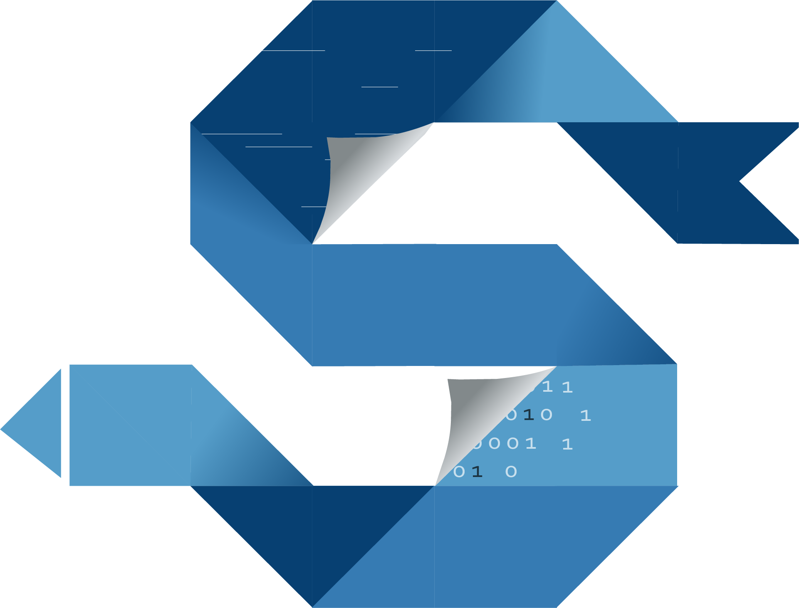
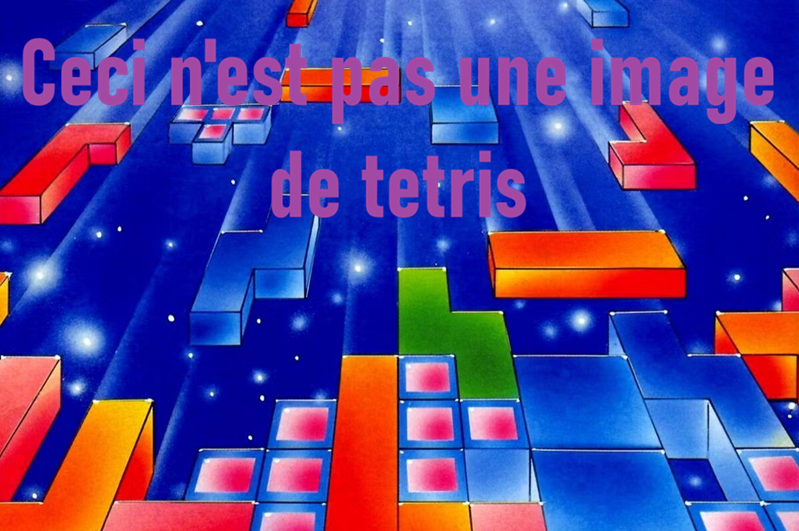

# Steg

<p align="center">
    
</p>

<div align="center">

**Cachez du code dans des images. Exécutez-les.**

[](https://isocpp.org/)
[](https://cmake.org/)
[]()
[]()
[](https://github.com/youkill081/steg-lang/blob/main/README.md)

</div>

---

## Vue d'ensemble

**Steg** est bien plus qu'un outil de stéganographie ; c'est une chaîne de compilation complète dont le code cible n'est pas un binaire, mais une **image PNG**.

Écrivez du code en **Steg** (langage haut niveau), compilez-le, et injectez-le silencieusement dans les pixels d'une image. L'image résultante est visuellement presque identique à l'originale, mais exécutable avec l'intepréteur Steg !


```
   Code Steg (.steg) <- Votre code !
        │
        ▼
  ┌─────────────────────────────────────────────────────┐
  │              Compilateur Steg                       │
  │  Lexer → Parser → AST → Sémantique → IR → Backend   │
  └─────────────────────────────────────────────────────┘
        │
        ▼
  Code StegASM (.stegasm) <- Vous pouvez aussi écrire directement en StegASM !
        │
        ▼
  ┌─────────────────────────────────────────────────────┐
  │              Assembleur StegASM                     │
  └─────────────────────────────────────────────────────┘
        │
        ▼
  Bytecode StegASM
        │
        ▼
  ┌─────────────────┐        ┌──────────────┐
  │  Stéganographie │ <----  │  Image PNG   │
  │  (injection)    │        │  (hôte)      │
  └─────────────────┘        └──────────────┘
        │
        ▼
  Image PNG (exécutable) ← programme caché ici
        │
        ▼
  ┌─────────────────┐
  │  Steg VM        │ <---- Interpréteur
  └─────────────────┘
```

## Démo

<p align="center">
    
    <br>
    <b>Charge WolfenSteg depuis l'image et joue.</b>
</p>

---

## Table des matières

<!-- TOC -->
* [Steg](#steg)
  * [Vue d'ensemble](#vue-densemble)
  * [Démo](#démo)
  * [Table des matières](#table-des-matières)
  * [Composant du projet](#composant-du-projet)
  * [Compilation](#compilation)
    * [Options de compilation](#options-de-compilation)
      * [Compteur d'instructions](#compteur-dinstructions)
  * [Utilisation - Steg](#utilisation---steg)
    * [Lancer un programme](#lancer-un-programme)
    * [Construire une image executable](#construire-une-image-executable)
    * [Lancer une image](#lancer-une-image)
    * [Mode debug](#mode-debug)
  * [Le langage Steg](#le-langage-steg)
  * [StegASM le langage bas niveau](#stegasm-le-langage-bas-niveau)
  * [StegLSP - le serveur de langage](#steglsp---le-serveur-de-langage)
  * [Exemples](#exemples)
    * [WolfenSteg - Steg](#wolfensteg---steg)
      * [Performance et capacité](#performance-et-capacité)
      * [Jouer](#jouer)
    * [Tetris - StegASM](#tetris---stegasm)
  * [Remerciement](#remerciement)
<!-- TOC -->

---

## Composant du projet

| Binaires    | Description                                                                                                                           |
|-------------|---------------------------------------------------------------------------------------------------------------------------------------|
| **Steg**    | Point d'entrée unifié du projet, permet de lancer du Steg/StegASM, d'éxécuter dans des images et également de build dans les images ! |
| **StegLSP** | Serveur LSP pour les fichiers .steg, directement connecté au compilateur steg !                                                       |

Malgré la forte composante from-scratch ; le projet s'appuie quand même sur quelques librairies externes (incluses en submodules) : 
- [**stb**](https://github.com/nothings/stb) - Lecture/Écriture de pixels pour la stéganographie, gère également plusieurs formats d'image
- [**raylib**](https://www.raylib.com/) - Moteur graphique, fenêtres, inputs...
- [**lsp-framework**](https://github.com/leon-bckl/lsp-framework) - Socle du serveur LSP
- [**googletest**](https://github.com/google/googletest) - Framework de tests

---

## Compilation

> [CMake 4.0+](https://cmake.org/download/) est requis.

Le programme a été conçu pour **Window** et **Linux** de manière cross-plateforme (les images crée sont compatibles avec les deux).   
Sur Windows il est conseillé d'utiliser [MinGW](https://www.mingw-w64.org/) pour compiler le projet afin d'avoir les meilleurs performances au niveau de l'interpréteur.


````shell
git submodule update --init --recursive
cmake -B build -DENABLE_INSTRUCTION_COUNTER=OFF
cmake --build build --config Release
````
### Options de compilation

#### Compteur d'instructions

Un compteur d'instruction par seconde (IPS) est disponible. Il afficheras toutes les secondes, le nombre d'instruction qui a été éxécuter.  
Il a été conçus pour rajouter le moins d'overhead possible, mais il reste désactivé par défaut.  
Pour l'activer, il suffit de rajouter le flag `-DENABLE_INSTRUCTION_COUNTER=ON`.

---

## Utilisation - Steg

`Steg` est le binaire principal du projet. Il joue un rôle multiple tels que la compilation ou le lancement des images.

````
USAGE:
  steg run <file.stegasm|file.steg> [-d]
  steg build <file.stegasm|file.steg> <input.png> <output.png>
  steg run_img 

OPTIONS:
  -d    Enable debug mode for compiler (Display, reg allocation, IR and AST code)
````

### Lancer un programme

Compile et éxécute directement un fichier source, sans passer par une image : 

````shell
steg run mon_programme.steg
steg run mon_programme.stegasm
````

Le lancement est directement compatible avec les fichiers **.steg** et **.stegasm**.

### Construire une image executable

Compile un programme (Steg ou StegASM) l'injecte dans une image PNG : 
````shell
steg build mon_programme.steg input.png output.png
steg build mon_programme.stegam input.png output.png
````

> L'image source peux ne pas être un .png cependant l'image de sortie dois **forcément** être au format **PNG**

### Lancer une image

Extrait et exécute le programme contenu dans une image :
````shell
steg run_img img.png
steg img.png # Format racourci
````

> Sur Windows, il est possible de faire "Lancer avec" sur l'image pour lancer le programme.


### Mode debug

Le flag `-d` active un affichage complet de la pipeline de compilation :
```shell
steg run mon_programme.steg -d
steg build mon_programme.steg input.png output.png -d
```
Le programme afficheras respectivement : 
- l'IR généré
- L'allocation des registres
- L'assembleur

Attentions, l'affichage de ces informations peux devenir très lourd avec de gros programmes !

---

## Le langage Steg

**Steg** est le langage haut niveau du projet. Il se compile en StegASM via une chaine complète :
````shell
Lexer -> Parseur -> AST -> Analyse sémantique -> IR -> Backend Génération StegASM
````

Les fichiers sources portent l'extension `.steg`.

> Une documentation de Steg est disponible [ici](./doc/steg.md).

--- 

## StegASM le langage bas niveau

**StegASM** est le langage bas niveau du projet. Il représente directement le jeu d'instruction disponible dans la VM StegVM.  
Fortement inspiré de l'assembleur "standart" il expose les registres et instruction de StegVM.

Les fichiers sources portent l'extension `.stegasm`.

> Une documentation de StegASM est disponible [ici](./doc/stegasm.md).

---

## StegLSP - le serveur de langage

`StegLSP` est un serveur **LSP** pour les fichier **.steg**.  
Grâce à ce serveur LSP, vous pouvez avoir sur la plupart des IDE moderne : 

- **Coloration Syntaxique**
- **Analyse sémantiques** -> contrôle de flux, types, paramètres etc...
- **Warnings** : Comme les conversions implicites

--- 

## Exemples

### WolfenSteg - Steg

WolfenSteg est un moteur de rendu pseudo-3D (Raycasting) entièrement écrit en Steg.  
C'est la vitrine technique du projet, prouvant que la VM et la chaîne de compilation peuvent gérer des calculs mathématiques intensifs en temps réel.  

#### Performance et capacité

- Raycasting temps réel : Le moteur tourne de manière fluide à 60 FPS.
- Puissance brute : La VM StegVM atteint des pics de performance à 250 millions d'instructions par seconde (IPS).

Gameplay : 
- Selection d'un niveau aléatoire au lancement
- Système de colision et gestion des déplacement
- Possibilité d'ouvrir les portes
- Système de combat basique pour éliminer les ennemis (vous pouvez changer d'arme avec les touches **1** - **2** - **3** et **4**)

#### Jouer

Vous pouvez soit directement lancer l'image WolfenSteg.png : 
````shell
steg run_img ./examples/wolfensteg/wolfensteg.png
````

Ou vous pouvez également le compiler vous même ! : 
````shell
steg run ./examples/wolfensteg/WolfenSteg.steg
````

### Tetris - StegASM

Le Tetris est la démonstration directe de **StegASM**.

  

Le code **StegASM** du Tetris est directement disponible ici : [./examples/tetris/tetris.stegasm](./examples/tetris/tetris.stegasm)

Vous pouvez donc lancer directement l'image : 
````shell
steg run_img ./examples/tetris/tetris.png
````

Ou la compiler vous même : 

````shell
steg run ./examples/tetris/tetris.stegasm
````

> ⚠️ Lancez les commandes depuis la **racine du repo**, sinon les imports `.stegasm` seront invalides.

## Remerciement

Merci beaucoup à Ewan Clein pour le design du logo Steg -> https://www.linkedin.com/in/ewan-clein-architecture/