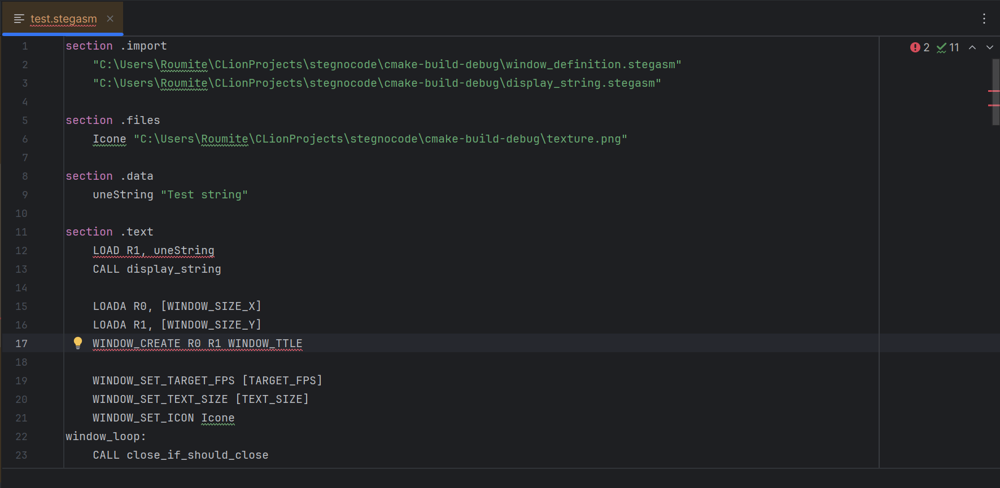

# Stegnocode

Stegnocode est une chaîne d'outils permettant de cacher du code et de l'exécuter depuis des images. Nous pouvons donc dire que stegnocode permet d'éxécuter des images.        
Elle est composée de deux outils principaux :  
- stegasm -> Un langage de programmation conçu pour être transformé en ByteCode, lui-même dissimulé dans des images.
- Stegnocode -> Un outil de stéganographie permettant de cacher et d'exécuter le ByteCode généré par stegasm.
Il peut également cacher du texte et des fichiers.

## Stegasm

Stegasm est un langage interprété fortement inspiré de l'assembleur. Il comporte malgré tout plusieurs aspects de langage haut niveau :
- Création de fenêtres graphiques
- Lecture, création et suppression de fichiers
- Gestion de la mémoire RAM

Ce langage dispose également d'un serveur LSP permettant la mise en évidence des erreurs en temps réel dans l'IDE.

Une documentation expliquant le codage des instructions et leur liste complète est disponible [ici](doc/stegasm.md)